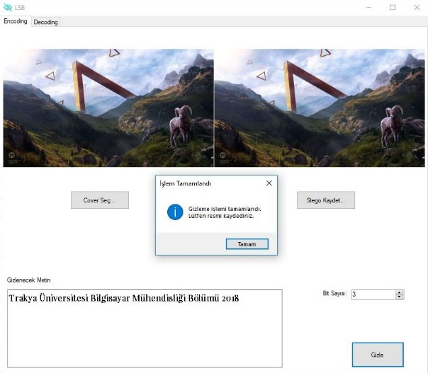
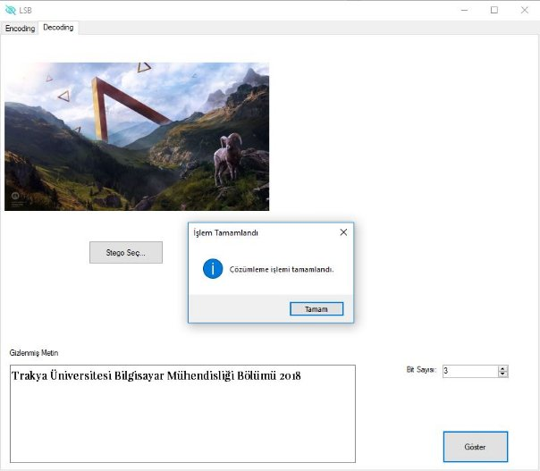

**Programın Amacı ve Genel Kullanımı**

Program, herhangi bir resmin piksellerine ait R, G, B renk kanallarını kullanarak, kullanıcı tarafından tanımlanan metni yine kullanıcı tanımlı olan bit sayısını kullanarak her bir pikselin renk kanallarının en düşük değerli belirli sayıda ki bitlerine (LSB- Least Signiture Bit) gizleyerek, metnin gizlenmiş olduğu yeni resmi döndürür ve gizlenen yazının doğru bit sayısı girilerek tekrar elde edilmesini sağlar.

Gizleme işlemleri yaparken Windows form üzerinde ilk olarak örtü (cover) olarak kullanacağımız resim seçilir. Sonra gizlenmesi istenilen metin ile renk kanalları üzerinde değişiklik yapılması istenilen en düşük değerlikli bit sayısı girilir ve işlemi gerçekleştirmek için gizle butonu seçilerek gerekli gizleme işlemlerinin yapılması sağlanır. Gizleme işlemi yapıldıktan sonra ise örtü resmin yanına değişiklik yapılan resim döndürülür. Döndürülen bu stego resim çözümleme işlemi için kaydedilebilir.

Resim 1 – Gizleme (Encoding) İşlemi

Çözümleme işlemi için ise içine metin gizlenen resim seçilir. Sonra metni gizleyen kullanıcı tarafından en düşük değerlikli kaç bit kullanıldıysa bu değer girilerek çözümleme işlemi yapılarak, gizlenmiş olan metin elde edilir.

Resim 2 – Çözümleme (Decoding) İşlemi

**Programın Genel Kod Yapısı ve Kullanılan Yöntem**

**Genel Kod Yapısı**

Bu işlemleri yaparken kullanılan class (sınıf), 2006 yapımı Prestij filminin açılış sahnesindeki “Bir sihirbazlık gösterisi 3 bölüm veya perdeden oluşur…” diye başlayarak “…henüz alkışlamazsınız. Çünkü bir şeyi yok etmek yeterli değildir. Onu geri getirmeniz gerekir.”  Diye devam eden cümleden hareketle “Prestij” olarak kullanıldı.

Prestij sınıfımızın içinde temel olarak 2 metot kullanıldı;

1) Gizleme yapılacak resim ve değiştirme yapılacak bit sayısını parametre olarak alan ve Bitmap veri türünde değer döndüren “Encode”
1) Çözümleme yapılacak resim ve değiştirme yapılacak bit sayısını parametre olarak alan ve string veri türünde değer döndüren “Decode”

**Kullanılan Yöntem**

1. **Encode Metodu**

Gizleme işlemi yapılırken kullanılan Encode metodu;

Kullanılan resmin ilk satır ve sütunundan başlayarak her pikselin R, G, B renk kanallarının belirnenen bitini kullanılarak kullanıcı tanımlı metnin gizlenmesi sağlanır. Resmin gidilecek pikselini seçmek için HashGetPixsel metodu kullanıldı. Resmin sınırlanın kontrolüyle beraber gizlenmek istenen metnin sonunun kontrolüde for döngüsü içinde yapıldı. Aksi halde metin olsa da olmasa da döngünün resmin sınırlarının sonuna kadar gitmesi önlenmiş olur. Döngüyle gidilen pikselin renk kanallarının belirlenen bit sayısı kadar temizlenmesi için, pikselin renk kanalının decimal değerinden, yine aynı renk kanalının, (2Değiştirilen Bit Sayısı) değeriyle modundan elde edilen decimal değerin farkı alınarak temizleme işlemi yapılmış olur. Burada her ne kadar decimal taban kullanılsa da yapılan işlemler bit boyutunda istenileni karşılamaktadır.

Bu işlemlerden sonra ana for döngüsünün içinde R, G, B kanal geçişlerinin sağlanması için bir alt döngü daha kullanıldı. Alt for döngüsünün içinde if-else yapılarıyla yeni karakteri gizlemeye geçildi mi, bütün karakterler gizlendi mi ve bunlara bağlı olarak yeni karakterin decimal değerinin alınarak gizleme işlemine switch-case yapısıyla devam edilir. 

Bu switch-case yapısı renk kanallarının geçişini sağlayan alt for döngüsü içinde, hangi renk kanalının üzerinde işlem yapacağımızın kontrolünü yaparak, renk kanallarının belirlenen son bitlerine yeni değerlerin eklenmesiyle set edilmesini sağlar. Bunu yaparken son bitleri temizleyerek yeni decimal değerleri elde edilen renk kanallarına, karakterin değerini (2Değiştirilen Bit Sayısı) değeriyle mod işleminden elde edilen değer, en düşük değerli bitten başlanarak eklenir ve bir sonraki iterasyonlar da doğru değerleri elde etmek için karakterin değerini, (2Değiştirilen Bit Sayısı) değerine bölerek elde edilen sonucu bir sonraki döngüde yine (2Değiştirilen Bit Sayısı) değeriyle mod alarak yaptığımız işlemi sıradaki renk kanalına ekleriz, gizlenecek karakterin en düşük değerlikli bitinden en yüksek değerlikli bitine doğru bu işlemin tekrarlanması sağlanır. İterasyon sayısı kullanılan en düşük değerlikli bitin sayısına göre değişir. 

Mesela “a” karakteri gizlenecek ve bunu son 3 biti değiştirerek yapacağız. Pikselin renk kanallarının değerlerinin hepsini, temizleme işlemi yapılmış haliyle “0” olarak kabul edelim a’ nın ascii değeri=65(0100 0001) ‘dir. 65 % 23 = 1(001) değeri R kanalının eklenir ve yeni değeri 1 olur. 65 / 23 = 8 işlemiyle bir sonraki iterasyona girecek “a” karakterinin değeri hesaplanmış olur. 8 % 23 =0(000) değeri G kanalına eklenir. Karakterin iterasyondaki yeni değerini bulmak için 8 / 23 = 1 hesaplanır. 1 % 8 = 1(001) değeri de G kanalına ekleyerek “a” karakterini bir pikselin R, G, B kanallarına gizlemiş olduk. Renk kanallarına eklediğimiz bitleri sırayla yazdığımızda (001 000 001) şeklinde olduğu görülür. 

R(0000 0000), G(0000 0000), B(0000 0000) olarak kabul edelim. Karakterin ascii değeri = 65

R = R + (65 % 23)                 R (0000 0001)

Karakterin ascii değeri / 23 = 8

G = G + (8 % 23)                 G (0000 0000)

Karakterin ascii değeri / 23 = 1

B = B + (1 % 23)                 B (0000 0001) olur.

Böylece bu bitlere “a” karakterinin ascii değeri olan 65 sayısı gizlenmiş olur.

Gizleme işlemi yapılırken renk kanallarının geçişi için kullanılan for döngüsünün altında yeni karakter kontrolünü gerçekleştiren yapıda karakter başına kullanılan bit sayısı, Türkçe ve diğer özel karakterleri de desteklemesi için en az 9 olacak şekilde seçildi ve kullanıcı tarafından tanımlanan renk kanallarının değiştirilmesi istenen {1, 2, 3, 4, 5, 6, 7, 8} miktarı kadar bit için gizlenecek karakter başına, ayrı renk kanallarının toplam olarak sırasıyla {9, 10, 9, 12, 10, 12, 14, 16} sayısı kadar biti kullanılır ve metnin sonuna kadar iterasyon yapılarak gizleme işlemi tamamlanır.

1. **Decode Metodu**

Çözümleme işlemi yapılırken kullanılan Decode metodu;

Kullanılan resmin ilk satır ve sütunundan başlayarak her pikselin R, G, B renk kanallarının belirlenen miktarda biti kullanılarak karşı kullanıcı tarafından gizlenen metnin çözümleme işlemi yapılır. Resmin piksellerini, satır ve sütunlar halinde ilerlemek için iç içe for döngüsü kullanıldı. Elde edilen pikselin renk kanallarının bitlerini, gizleme işleminde kullanılan bit miktarı kadarını maskelemek için renk kanallarının, varolan değeri yani karakter gizlenmiş decimal değeri ile (2Değiştirilen Bit Sayısı-1) ‘in değerinin bitsel olarak and işlemi uygulanması sonucu, çözümleme için gerekli kısmın decimal değeri elde edilmiş olur. Resmin sınırlanın kontrolüyle beraber gizlenen metnin sonunun kontrolü için Encode metodunda, metnin sonuna “'\0'” null değer eklemiştik. Böylece çözümleme işleminde sadece metnin çözümlenmesini sağlanır. Gereksiz olarak resmin diğer piksellerinden gelecek olan anlamsız karakterlerin gösterilmemesi sağlanır. Gereksiz döngü olmaması ve hızlı olarak çözümleme yapılması sağlanır. 

Piksel geçişlerinin sağlayan ana for döngüsünün içinde R, G, B kanal geçişlerinin sağlanması için bir alt for döngüsü daha kullanıldı. Alt for döngüsünün içinde if-else yapılarıyla yeni karakteri çözümlemeye geçildi mi, bütün karakterler çözümlendi mi ve bunlara bağlı olarak elde edilen gizlenmiş olan karakterin ascii karşılığı elde edildikten sonra çözümlenen metnin sonuna eklenir ve çözümleme işlemine switch-case yapısıyla devam edilir.

Switch-case yapısıyla hangi renk kanalından veri okunacağı elde edilir. Hangi kanaldan okuma yapılacaksa, maskeleme yapılmış kanalların decimal değerleriyle n=0 için 2Değiştirilen Bit Sayısı^0, n=1 için 2Değiştirilen Bit Sayısı^1, …, gizleme işlemi yapılırken kullanılan bit sayısının miktarına göre n değişkeni arttırılarak elde edilen değerler, yeni karakter geçişine kadar toplanarak gizlenmiş değerin decimal karşılığı elde edilir. Aslında binary tabandan decimal tabana çevirme işleminde kullanılan yöntemi 2Değiştirilen Bit Sayısı için yapmış olduk.

Mesela, gizleme işleminde “a” karakterini gizlerken kullanılan pikselin, R kanalına 1(001), G kanalına 0(000) ve B kanalına da 1(001) değerlerini set etmiştik. Aynı zamanda yukarıda yaptığımız maskeleme işlemiyle bu renk kanallarının sadece son 3 bitini elde ederek aslında bize lazım olan decimal değerleri döndürmüş olduk. Bu işlemleri sırasıyla, gizlenmiş karakterin decimal değeri = (R’nin değeri \* 2Değiştirilen Bit Sayısı^0) + (G’nin değeri \* 2Değiştirilen Bit Sayısı^1) + (B’nin değeri \* 2Değiştirilen Bit Sayısı^2) olarak elde ederiz. 

Karakterin değeri = (1\*8^0) + (0\*8^1) + (1\*8^2)

`                `= 1 + 0 + 64

`                `= 65 olarak elde edilir.

Bu 65 değeri ascii tablosunda “a” nın değerini karşılamaktadır. Burada gerekli char dönüştürme işlemini yaparak, çözümlemede şu ana kadar bulunan metnin sonuna elde edilen bu karakter eklenerek işlemine devam edilir.

Döngüler sınırlarına ulaşıp, çıkıldığında kullandığımız metodumuz çözümlemek istediğimiz, gizlenmiş olan metni dördermiş olur. 

1. **HashGetPixel**

Gizlenen veya çözümlenen metnin işlem yapılan karakterin indisini (i) değişken olarak alarak

Y = i div x

X = i mod x

Y = (Y + fk(X)) mod y

X = (X + fk(Y)) mod x

Y = (Y + fk(X)) mod y

Return X, Y

İşlemleri uygulanarak, işlem yapılacak piksel seçilmiş olur. 
